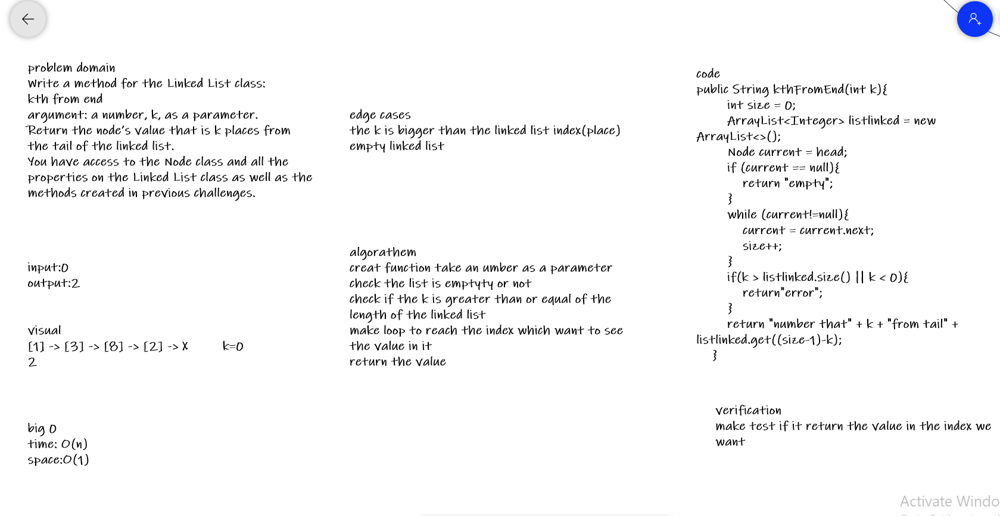
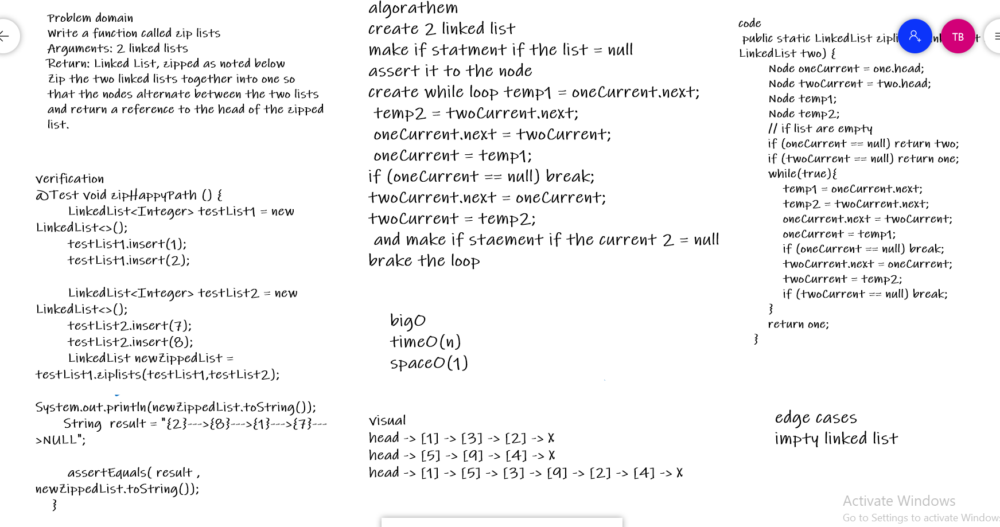

# code challenge 7 
Write a method for the Linked List class:
kth from end
argument: a number, k, as a parameter.
Return the node’s value that is k places from the tail of the linked list.
You have access to the Node class and all the properties on the Linked List class as well as the methods created in previous challenges.
## Whiteboard Process

## Approach & Efficiency
big 0
time: O(n)
space:O(1)

# code challenge 8
Write a function called zip lists
Arguments: 2 linked lists
Return: Linked List, zipped as noted below
Zip the two linked lists together into one so that the nodes alternate between the two lists and return a reference to the head of the zipped list.

## Whiteboard Process

## Approach & Efficiency
bigO
timeO(n)
spaceO(1
