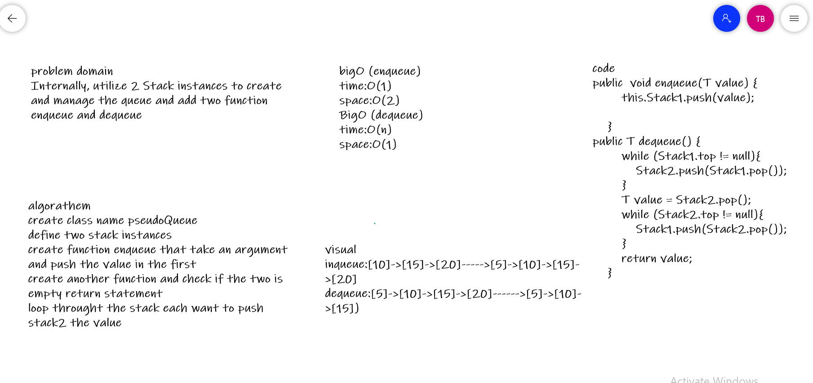

# Challenge Summary
Internally, utilize 2 Stack instances to create and manage the queue and add two function enqueue and dequeue

## Whiteboard Process

## Approach & Efficiency
bigO (enqueue)
time:O(1)
space:O(2)
BigO (dequeue)
time:O(n)
space:O(1)

## Solution
create class name pseudoQueue define two stack instances create function enqueue that take an argument and push the value in the first
create another function and check if the two is empty return statement loop throught the stack each want to push stack2 the value
